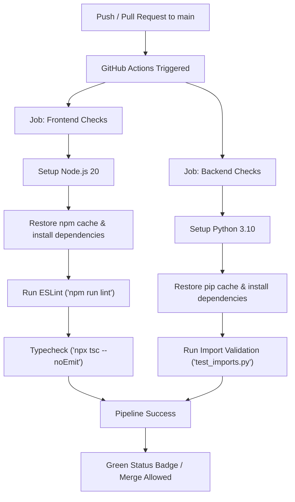

# GitHub Actions CI/CD Setup Guide

This guide walks you through setting up and understanding a Continuous Integration (CI) pipeline for the **We See You** project using GitHub Actions.

A `.github/workflows/ci.yml` configuration file has been automatically created in your project workspace. This file defines an automated pipeline that runs on every push or pull request to the `main` or `master` branches, checking both your frontend and backend for quality, syntax correctness, and compilation errors.

---

## 1. Pipeline Overview

Here is a visual representation of how the CI pipeline runs when you push changes to GitHub:



---

## 2. Configuration Walkthrough

The configuration is located in [.github/workflows/ci.yml](file:///D:/WebProjects/weseeyou/.github/workflows/ci.yml) and is structured as follows:

### Triggers
```yaml
on:
  push:
    branches: [ main, master ]
  pull_request:
    branches: [ main, master ]
```
This tells GitHub to trigger the pipeline on push events and pull requests targeting either `main` or `master`.

### Frontend Job
* **WorkingDirectory**: Runs inside `Frontend/we-see-you`.
* **Caching**: Caches the `node_modules` directory under `~/.npm` based on `package-lock.json` to speed up future runs.
* **Dependencies**: Uses `npm ci` for clean, reliable installs from the lockfile.
* **Type-check**: Runs `npx tsc --noEmit` which parses TypeScript types without compiling files to disk.

### Backend Job
* **WorkingDirectory**: Runs inside `Backend`.
* **Caching**: Caches the pip packages based on [requirements.txt](file:///D:/WebProjects/weseeyou/Backend/requirements.txt).
* **Dependencies**: Upgrades pip and installs packages listed in the new `requirements.txt`.
* **Import check**: Executes [test_imports.py](file:///D:/WebProjects/weseeyou/Backend/test_imports.py) to check that core dependencies (FastAPI, requests, Pydantic, etc.) load successfully and contain no import or syntax errors.

---

## 3. Step-by-Step GitHub Setup

Follow these steps to connect your local repository to GitHub and see the pipeline in action:

### Step 3.1: Create a GitHub Repository
1. Go to [GitHub](https://github.com/) and log in.
2. Click **New** to create a repository.
3. Name it `weseeyou` and leave it empty (do **not** check "Add a README", "Add .gitignore", or "Choose a license" since they already exist in your local workspace).

### Step 3.2: Initialize and Push Local Repository
If your repository isn't already initialized and linked, open your terminal (PowerShell or Git Bash) in `D:\WebProjects\weseeyou` and run:

```bash
# Initialize git (if not already done)
git init

# Add remote link (replace USERNAME with your GitHub handle)
git remote add origin https://github.com/USERNAME/weseeyou.git

# Set your branch name to main
git branch -M main

# Add all files to staging
git add .

# Commit changes
git commit -m "chore: setup github actions ci/cd pipeline and backend requirements"

# Push to origin
git push -u origin main
```

### Step 3.3: Observe the Pipeline Running
1. Go to your repository on GitHub.
2. Click on the **Actions** tab at the top.
3. You will see your commit message under the **All workflows** list. Click on it.
4. You will see two parallel jobs running: **Frontend Quality Checks** and **Backend Quality Checks**. Click on either job to view real-time log outputs!

---

## 4. Best Practices & Expanding the Pipeline

> [!IMPORTANT]
> **Never commit secret keys (like `FEC_API_KEY` or `.env` files) to your repository.**
> The `.gitignore` file already excludes `.env` files. To pass keys to production deployments or automated tests on GitHub Actions:
> 1. In your GitHub repository, navigate to **Settings** > **Secrets and variables** > **Actions**.
> 2. Click **New repository secret**.
> 3. Name it `FEC_API_KEY` and paste your key.
> 4. Reference it in your workflow file (or production host configs) as `{{ secrets.FEC_API_KEY }}`.

### Adding Unit Tests
When you add test files later (e.g., using `pytest` for Python or `jest` for React/Next.js):
1. **Frontend**: Add a test step under the frontend job:
   ```yaml
   - name: Run Tests
     run: npm run test
   ```
2. **Backend**: Add a test step under the backend job:
   ```yaml
   - name: Run pytest
     run: pytest
   ```

### Continuous Deployment (CD)
You can extend this pipeline to deploy automatically once code passes all checks:
* **Frontend**: Next.js apps deploy seamlessly to **Vercel** or **Netlify**. Vercel connects directly to your GitHub repo and handles this out-of-the-box.
* **Backend**: FastAPI can be deployed easily to platforms like **Render**, **Fly.io**, or **Railway** by adding deployment hooks to the end of the CI file.
