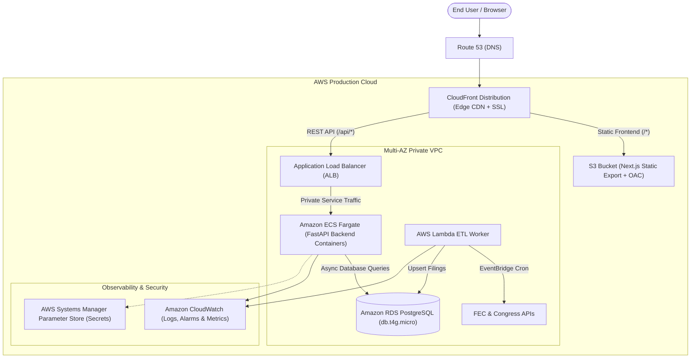

# We See You (WSY)

[](https://github.com/CammyCam04/weseeyou/actions/workflows/ci.yml)
[](https://nextjs.org/)
[](https://react.dev/)
[](https://fastapi.tiangolo.com/)
[](https://www.python.org/)
[](https://www.postgresql.org/)
[](https://www.terraform.io/)
[](https://aws.amazon.com/)

> **A nonpartisan political transparency portal tracking U.S. national, state, and local elected officials, campaign finance flows, Super PAC funding, and legislative activity.**

---

> [!NOTE]
>
> ### Project Status: Active Work in Progress
>
> **We See You** is actively under development as a full-stack, enterprise-grade political transparency platform and cloud infrastructure showcase. New features, live data pipelines, and infrastructure modules are continuously being added.

---

## Table of Contents

1. [About the Project](#-about-the-project)
2. [Current Implemented Features](#-current-implemented-features)
3. [Live Data Sources](#-live-data-sources)
4. [System Architecture](#-system-architecture)
5. [Tech Stack](#-tech-stack)
6. [Future Roadmap](#-future-roadmap)
7. [Local Development & Setup](#-local-development--setup)
8. [Automated Testing & CI/CD](#-automated-testing--cicd)

---

## About the Project

Money in politics and municipal governance can often feel opaque and difficult to navigate. **We See You** solves this by consolidating federal, state, and local government data into an intuitive, visually rich transparency dashboard.

Whether investigating a U.S. Senator's Super PAC backers, comparing election cycle fundraising trends, or exploring county judges and city council seats, **We See You** surfaces verified public records without editorial bias.

---

## Current Implemented Features

### 1. National Congressional Explorer

- **Complete Federal Directory**: Search, filter, and inspect all 535 voting members of the United States Senate and House of Representatives.
- **Dynamic Filtering**: Instant multi-attribute filtering across Chamber (Senate/House), Political Party (Democrat, Republican, Independent), and U.S. State/Territory.
- **Official Profiles**: In-depth profiles highlighting current office, congressional districts, committee assignments, tenure history, leadership roles, and official website/social media channels.

### 2. Campaign Finance & Outside Spending Engine

- **Visual Percentage Donut Chart**: D3-powered interactive Donut graph breaking down funding into three distinct buckets:
  - **Individual & Grassroots**: Direct citizen donations (<$200) and unitemized grassroots contributions.
  - **Traditional PAC Direct**: Regulated corporate, labor union, and committee PAC contributions.
  - **Super PAC & Outside Funds**: Independent expenditure-only committees, 501(c)(4) social welfare action funds, and leadership funds.
- **Multi-Year Historical Fundraising**: Comparative multi-cycle bar charts showing financial growth and trends across prior election runs.
- **Synchronized Itemized PAC Lists**: Filterable lists of corporate/labor PACs and Super PAC donors with exact dollar amounts, percentages, and outside spending classifications.
- **Top-10 List Smart Expansion**: Clean 10-item initial display with instant expansion to view all verified donors.

### 3. Career Chamber & Lifetime Aggregator

- **Multi-Chamber Switcher**: For lawmakers who served in both chambers (e.g. U.S. House prior service followed by U.S. Senate), users can seamlessly switch between chambers or view their **Complete Career History**.
- **Lifetime Financial Aggregation**: In Complete Career History mode, the Donut graph, metric cards, and PAC itemized lists dynamically aggregate all contributions received across the official's entire congressional career.

### 4. State & Municipal Leadership Directory

- **State Executive & Legislature**: Overview of governors, lieutenant governors, attorneys general, and state legislative chambers.
- **County & Municipal Governance**: Geolocation-aware search resolving city/ZIP inputs to display county judges, commissioners, sheriffs, mayors, city managers, and district city council members.

---

## Live Data Sources

All data displayed on **We See You** is aggregated directly from official, nonpartisan government records and open data APIs:

| Provider / API                            | Description                                                        | Data Extracted                                                                                                |
| :---------------------------------------- | :----------------------------------------------------------------- | :------------------------------------------------------------------------------------------------------------ |
| **Federal Election Commission (FEC API)** | Official U.S. Federal Campaign Finance API                         | Candidate committee totals, itemized PAC contributions, independent expenditures, and election cycle filings. |
| **United States Congress Dataset**        | Open-source congressional repository maintained by `@unitedstates` | Member biographies, terms of service, leadership positions, social handles, and committee rosters.            |
| **OpenStreetMap Nominatim API**           | Open geospatial location resolver                                  | Precise municipal, county, and state boundary resolution from ZIP codes and city names.                       |
| **Wikimedia & MediaWiki REST APIs**       | Open encyclopedia and structured infoboxes                         | Municipal government rosters, city council seats, and executive bios.                                         |
| **Google Civic Information API**          | Verified government representative directory                       | Supplemental civic official contact information and district assignments.                                     |

---

## System Architecture



---

## Tech Stack

### Frontend

- **Framework**: [Next.js 16 (App Router)](https://nextjs.org/) + [React 19](https://react.dev/)
- **Language**: TypeScript 5
- **Styling**: SCSS Modules + Custom CSS Design System (Glassmorphism, Dark Mode, Accessible Contrast)
- **Data Visualization**: [D3.js](https://d3js.org/) (Interactive SVG Donut & Bar Charts)
- **Icons**: [Hugeicons React](https://hugeicons.com/)
- **Testing**: [Vitest](https://vitest.dev/) + [React Testing Library](https://testing-library.com/) + [Happy-DOM](https://github.com/capricorn86/happy-dom)

### Backend

- **Framework**: [FastAPI](https://fastapi.tiangolo.com/) (Asynchronous Python Web Framework)
- **Language**: Python 3.12
- **Data Validation**: [Pydantic v2](https://docs.pydantic.dev/)
- **HTTP Client**: [HTTPX](https://www.python-httpx.org/) (Async HTTP & API integrations)
- **Testing**: [Pytest](https://docs.pytest.org/) + [FastAPI TestClient](https://fastapi.tiangolo.com/tutorial/testing/)

### Infrastructure & Cloud (IaC)

- **Cloud Provider**: Amazon Web Services (AWS)
- **Infrastructure as Code**: [Terraform 1.7+](https://www.terraform.io/)
- **Compute**: Amazon ECS on AWS Fargate (Containerized Microservices)
- **Database**: Amazon RDS PostgreSQL 16 (Declarative Partitioning + JSONB Documents + `pg_trgm` GIN Indexes)
- **ORM & Migrations**: SQLAlchemy 2.0 (AsyncPG) + Alembic
- **Serverless Ingestion**: AWS Lambda + Amazon EventBridge
- **Delivery & CDN**: Amazon CloudFront + Amazon S3 (Origin Access Control)
- **CI/CD**: GitHub Actions (Linting, TypeScript check, Vitest suite, Pytest suite, Terraform validation, and Dynamic CD Pipeline)

---

## Project Roadmap & Status

- [ ] **Live Congressional Roll-Call Votes**: Real-time tracking of House and Senate bill votes with individual member voting history.
- [ ] **State Campaign Finance Expansion**: Integrating state-level campaign finance registries (e.g. FollowTheMoney / OpenSecrets state data).
- [ ] **Custom Citizen Watchlists**: Bookmarking politicians, tracking changes in top donor categories, and receiving alerts on major Super PAC expenditures.
- [ ] **Mobile Display**: Configure the site to be mobile device compatible.
- [ ] **More/TBD**

---

## Local Development & Setup

### Prerequisites

- Node.js 20+ and `npm`
- Python 3.10+ and `pip`
- Git

### 1. Clone Repository

```bash
git clone https://github.com/CammyCam04/weseeyou.git
cd weseeyou
```

### 2. Backend Setup

```bash
cd Backend
python -m venv venv
# On Windows (PowerShell):
.\venv\Scripts\Activate.ps1
# On macOS/Linux:
source venv/bin/activate

pip install -r requirements.txt
uvicorn app.main:app --reload --port 8000
```

_The FastAPI backend will run at `http://localhost:8000` (API Docs at `http://localhost:8000/docs`)._

### 3. Frontend Setup

```bash
cd ../Frontend/we-see-you
npm install
npm run dev
```

_The Next.js frontend will run at `http://localhost:3000`._

### 4. Infrastructure (Terraform) Setup

```bash
cd terraform
cp terraform.tfvars.example terraform.tfvars
terraform init
terraform plan
```

---

## Automated Testing & CI/CD

Both frontend and backend include comprehensive unit test suites integrated into GitHub Actions CI:

### Run Frontend Tests & Linter

```bash
cd Frontend/we-see-you
npm run test     # Executes Vitest test suite
npm run lint     # Executes ESLint check
npx tsc --noEmit # Validates TypeScript types
```

### Run Backend Tests

```bash
cd Backend
pytest -v        # Executes Pytest suite
```

---

## License

This project is open-source under the [MIT License](LICENSE).
